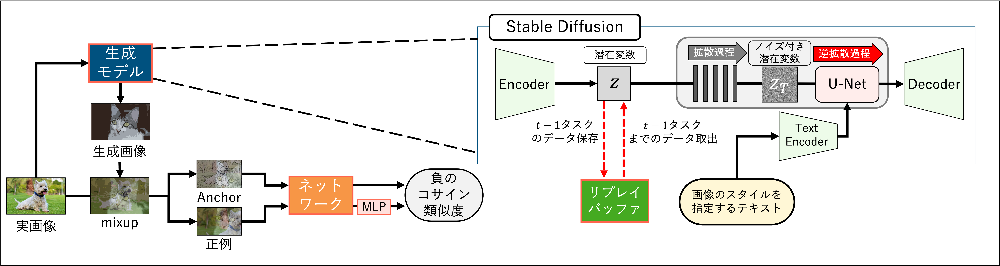

# テキスト指示による画像スタイル変換を導入した</br>生成リプレイによる自己教師あり継続学習  
卒業論文「テキスト指示による画像スタイル変換を導入した生成リプレイによる自己教師あり継続学習」のプログラムファイル．

**著者**: [若尾　正哉](http://www.mprg.cs.chubu.ac.jp/~masa21/Research/index.html)　(わかお　まさや)

## 提案手法
テキスト指示による画像スタイル変換を導入した生成リプレイによる自己教師あり継続学習法を提案する．</br>
提案手法は，生成リプレイによる継続学習法と経験リプレイによる自己教師あり継続学習法を組み合わせ，従来手法の問題点を解決する．</br>
提案手法では，過去のタスクで学習したデータの潜在変数を，一定数だけリプレイバッファに保存する．</br>
保存した潜在変数を生成モデルに入力することで，過去のデータを生成し，学習に使用する．</br>
また，生成モデルに油絵風やピクセルアート風等のスタイルを指定するテキストを入力することで，同一の潜在変数から多様な画像を生成する．</br>



## 動作環境
conda環境を利用しました．</br>
以下にDockerfileを使ったコンテナ作成から，conda環境の構築までの流れを示します．
### イメージの作成
プログラムファイルに移動して，
```
docker build ./ --force-rm --no-cache -t {image-name}
```
### コンテナの作成
```
docker run -it --gpus all --shm-size=8G -v {自身のフォルダ}:/home/$USER --name {container-name} {image-name}
```
### コンテナに移る
```
docker attach {container-name}
```
### conda環境の作成
プログラムファイルに移動して，
```
conda env create -f environment.yml
```

### conda環境の作成
```
conda init
exec $SHELL #ターミナルの再起動
conda env create -f environment.yml
```
（ここまでは再現済み）</br>
あとはDiffuserをインストール．</br>
### cv2エラー
動かす際にcv2のエラーが出たら以下を試す．
```
apt-get update
apt-get install libglib2.0-0
```
※「requirements-conda.txt」「requirements-container.txt」は念のために置いておきます．


## Diffusers
このプログラムは，[Hugging Face](https://huggingface.co/)が提供する[Diffusers](https://huggingface.co/docs/diffusers/index)を利用します．</br>
手順に倣ってフォルダ内に[Diffusersをインストール](https://huggingface.co/docs/diffusers/installation)してください．</br>
利用するモデルは，[Stable Diffusion v1-5](https://huggingface.co/stable-diffusion-v1-5/stable-diffusion-v1-5)です．</br>
こちらもフォルダ内にインストールしてください．

## 実行
### CIFAR-10
CIFAR-10の実行は，以下のコードで実行・評価まで可能です．
```
$ python run_c10.py
```
実験条件の変更は，以下のファイル内で設定できます．
```
configs/simsiam_c10.yaml
```
タスク数・クラス数の変更は，以下のファイル内で設定できます．
```
datasets/seq_cifar10.py
```

### CIFAR-100
CIFAR-100の実行は，以下のコードで実行・評価まで可能です．
```
$ python run_c100.py
```
実験条件の変更は，以下のファイル内で設定できます．
```
configs/simsiam_c100.yaml
```
タスク数・クラス数の変更は，以下のファイル内で設定できます．
```
datasets/seq_cifar100.py
```

### Tiny ImageNet
Tiny ImageNetの実行は，以下のコードで実行・評価まで可能です．
```
$ python run_tinyimagenet.py
```
実験条件の変更は，以下のファイル内で設定できます．
```
configs/simsiam_run_tinyimagenet.yaml
```
タスク数・クラス数の変更は，以下のファイル内で設定できます．
```
datasets/seq_run_tinyimagenet.py
```

## 実行時に作成されるフォルダ
### ・checkpoints
ネットワークの重みがデータセットごとに保存されます．
### ・SAMPLING
生成画像を可視化する場合，データセットごとに生成画像が保存されます．</br>
生成画像の可視化の有無はconfigsに含まれる実験条件を変更するフォルダで設定できます．</br>
### ・choice_data
生成画像を可視化する場合，リプレイバッファに保存する潜在変数として選択される生成画像が保存されます．</br>
生成画像の可視化の有無はconfigsに含まれる実験条件を変更するフォルダで設定できます．</br>
## べースとなったプログラム
このプログラムは，[Lifelong Unsupervised Mixup (Lump)](https://github.com/divyam3897/UCL)のプログラムをベースに作成しました．